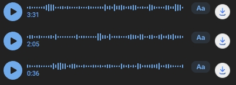

# VK Voice Downloader

`VK Voice Downloader` — это браузерное расширение на Manifest V3 для Chromium-совместимых браузеров, которое добавляет кнопку скачивания рядом с голосовыми сообщениями VK, уже доступными пользователю в интерфейсе.

Проект намеренно сделан лёгким: без сборщика, без фреймворков, без серверной части и без прямой интеграции с приватным API. Вся логика работает локально в браузере и опирается только на данные, уже присутствующие в React-дереве страницы.

Расширение ориентировано на ручную установку в режиме разработчика и наглядную демонстрацию подхода к работе с динамическим DOM, MV3 и page-owned React internals.

## Зачем нужен этот проект

У голосовых сообщений VK обычно нет прямого `audio src` в обычном DOM. Ссылки на аудиофайлы находятся глубже, в данных React-страницы, например:

- `message.attaches.voice.linkOgg`
- `message.attaches.voice.linkMp3`
- `audioTrack.url`

Этот проект показывает, как можно аккуратно построить над этим ограничением надёжное MV3-расширение и при этом сохранить код поддерживаемым, безопасным и пригодным для публичного портфолио.

## Ключевые возможности

- Добавляет компактную кнопку скачивания рядом с каждым голосовым сообщением
- Поддерживает динамически загружаемые сообщения через `MutationObserver`
- Извлекает ссылки на аудио из React Fiber / React props
- Использует несколько fallback-путей на случай изменений во внутренней структуре VK
- Загружает файлы через стандартный браузерный `chrome.downloads`
- Хранит состояние ВКЛ/ВЫКЛ локально через `chrome.storage.local`
- Работает полностью на стороне пользователя

## Как это работает технически

### Поток выполнения

1. Content script находит на странице узлы `.AttachVoice`.
2. Для каждого голосового сообщения он добавляет компактную кнопку внутрь `.AttachVoice__player`.
3. При клике по кнопке content script временно помечает DOM-узел специальным токеном.
4. Service worker запускает извлечение данных в `MAIN` world страницы через `chrome.scripting.executeScript(...)`.
5. Код в контексте страницы обходит ближайшие React internals и проверяет несколько известных путей:
   - `memoizedProps.message.attaches.voice.linkOgg`
   - `memoizedProps.message.attaches.voice.linkMp3`
   - `pendingProps.message.attaches.voice.linkOgg`
   - `pendingProps.message.attaches.voice.linkMp3`
   - `memoizedState.memoizedState.current.audioTrack.url`
6. Лучший доступный URL возвращается обратно в расширение.
7. Service worker запускает скачивание через API браузера с понятным именем файла.

### Почему здесь используется React Fiber

Расширение **не** пытается обходить авторизацию и **не** делает скрытых запросов к приватным внутренним endpoint'ам. Оно работает только с теми данными, которые уже доступны пользователю в открытом интерфейсе VK после загрузки диалога.

Практически это означает, что страница уже содержит метаданные голосового сообщения внутри React-объектов, но обычный DOM при этом не даёт пригодного `audio[src]`. Поэтому расширение использует инспекцию React internals страницы, а не пытается опереться на несуществующий прямой источник в DOM.

## Архитектура проекта

Репозиторий организован так, чтобы оставаться простым для ручной загрузки в браузер, но при этом выглядеть аккуратно и профессионально при публичном просмотре.

```text
.
├── assets/
│   ├── icons/
│   └── ui/
├── docs/
│   ├── ARCHITECTURE.md
│   └── screenshots/
├── src/
│   ├── background/
│   ├── content/
│   └── popup/
├── manifest.json
├── README.md
├── CHANGELOG.md
├── CONTRIBUTING.md
├── PRIVACY.md
├── DISCLAIMER.md
├── LICENSE
├── .editorconfig
└── .gitignore
```

### Зоны ответственности

- `src/content/content-script.js`
  Поиск голосовых сообщений, инъекция кнопки, взаимодействие с runtime расширения, генерация имени файла и наблюдение за новыми сообщениями.

- `src/background/service-worker.js`
  Инициализация настроек, безопасная обработка загрузок и выполнение извлечения данных через `chrome.scripting`.

- `src/popup/`
  Небольшой UI для локального включения и отключения расширения.

- `assets/icons/`
  Иконки расширения для панели браузера и страницы расширений.

- `assets/ui/download-icon.svg`
  Иконка кнопки скачивания, вставляемая в интерфейс VK.

Более подробное техническое описание вынесено в [docs/ARCHITECTURE.md](docs/ARCHITECTURE.md).

## Установка

### Загрузка как распакованного расширения

1. Склонируйте или скачайте репозиторий.
2. Откройте `browser://extensions` или `chrome://extensions`.
3. Включите **Режим разработчика**.
4. Нажмите **Загрузить распакованное расширение** / **Load unpacked**.
5. Выберите корень репозитория.
6. Откройте `vk.com` и обновите страницу.

### Поддерживаемые браузеры

- Google Chrome
- Chromium
- Microsoft Edge
- Яндекс.Браузер
- Другие Chromium-совместимые браузеры с поддержкой Manifest V3

## Использование

1. Откройте диалог VK, в котором есть голосовые сообщения.
2. Найдите плеер голосового сообщения.
3. Нажмите на кнопку скачивания, появившуюся рядом с плеером.
4. Браузер начнёт загрузку файла с осмысленным именем, если нужные метаданные доступны на странице.

Состояние popup:

- `Включено`: расширение добавляет кнопки скачивания на страницах VK
- `Выключено`: существующие кнопки удаляются, новые не вставляются

## Ограничения

- Расширение зависит от текущей DOM-структуры VK и внутренних React-данных страницы.
- Если VK изменит имена классов или пути к данным, логику извлечения может потребоваться обновить.
- Расширение работает только с тем контентом, который уже доступен пользователю в веб-интерфейсе VK.
- Состав имени файла зависит от тех метаданных, которые VK реально держит в текущем состоянии страницы.

## Безопасность, приватность и корректное позиционирование

- Нет автоматизации логина
- Нет работы с учётными данными
- Нет прямого клиента приватного API
- Нет серверной обработки
- Нет аналитики и телеметрии
- Нет извлечения данных за пределами уже отрисованного интерфейса

Настройки расширения хранятся локально через `chrome.storage.local`. Дополнительно см. [PRIVACY.md](PRIVACY.md) и [DISCLAIMER.md](DISCLAIMER.md).

## Скриншоты и демо

Кнопка скачивания, встроенная рядом с голосовым сообщением:


